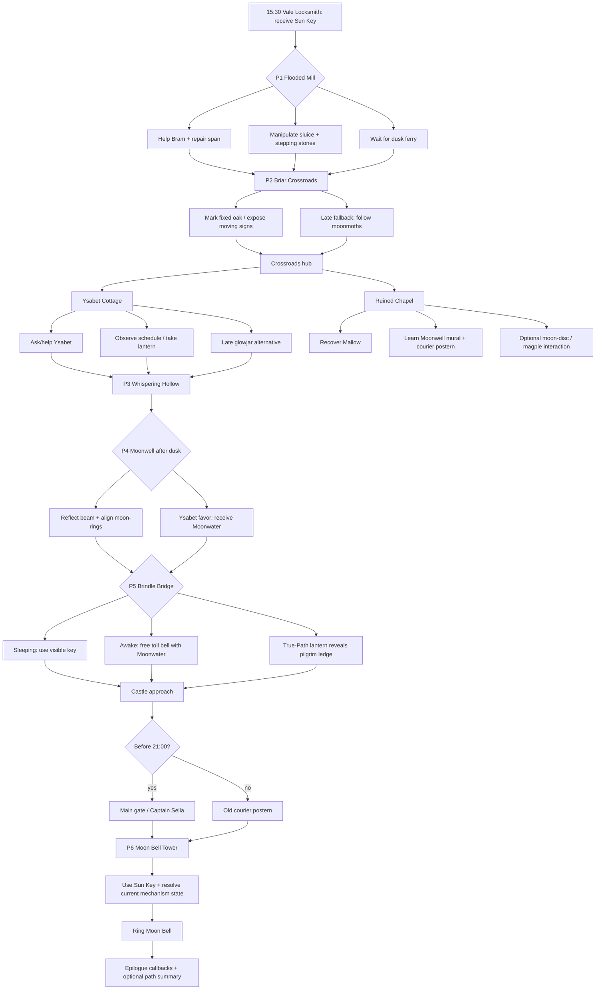

# Puzzle / World Graph — The Moon Bell

## Structural rule

The graph folds at major landmarks, but solution history remains meaningful:
- time;
- inventory;
- permission;
- favors;
- witnessed actions;
- NPC memories;
- which clues were discovered;
- world phase.

No reconvergence may silently erase those.
