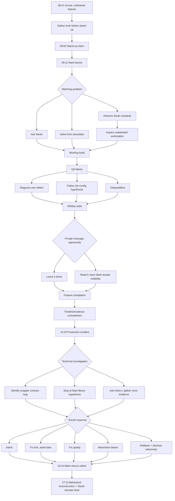

# Puzzle / Dependency Graph

```mermaid
flowchart TD
    A[08:47 Arrival: unfinished feature] --> B[Gather truth before stand-up]
    B --> C[09:00 Stand-up claim]
    C --> D[09:11 Mark leaves]
    D --> E{Matching problem}
    E --> E1[Ask Sarah]
    E --> E2[Solve from docs/data]
    E --> E3[Observe Sarah schedule]
    E3 --> E4[Inspect unattended workstation]
    E1 --> F[Working build]
    E2 --> F
    E4 --> F
    F --> G[QA failure]
    G --> G1[Diagnose own defect]
    G --> G2[Follow QA-config hypothesis]
    G --> G3[Delay/deflect]
    G1 --> H[Midday state]
    G2 --> H
    G3 --> H
    H --> I{Private message opportunity}
    I --> I1[Leave it alone]
    I --> I2[Read it: learn Mark doubts reliability]
    I1 --> J[Feature completion]
    I2 --> J
    J --> K[Timeline/evidence contradiction]
    K --> L[14:20 Production incident]
    L --> M{Technical investigation}
    M --> M1[Identify wrapper contract bug]
    M --> M2[Stop at false library hypothesis]
    M --> M3[Ask others / gather more evidence]
    M1 --> N{Social response}
    M2 --> N
    M3 --> N
    N --> N1[Admit]
    N --> N2[Fix first, admit later]
    N --> N3[Fix quietly]
    N --> N4[Allow/steer blame]
    N --> N5[Rollback + disclose selectively]
    N1 --> O[16:10 Mark returns online]
    N2 --> O
    N3 --> O
    N4 --> O
    N5 --> O
    O --> P[17:15 Behavioral reconstruction + Sarah elevator beat]
```

The graph folds at major dramatic beats, but persistent state carries forward. Reconvergence must never erase meaning.
